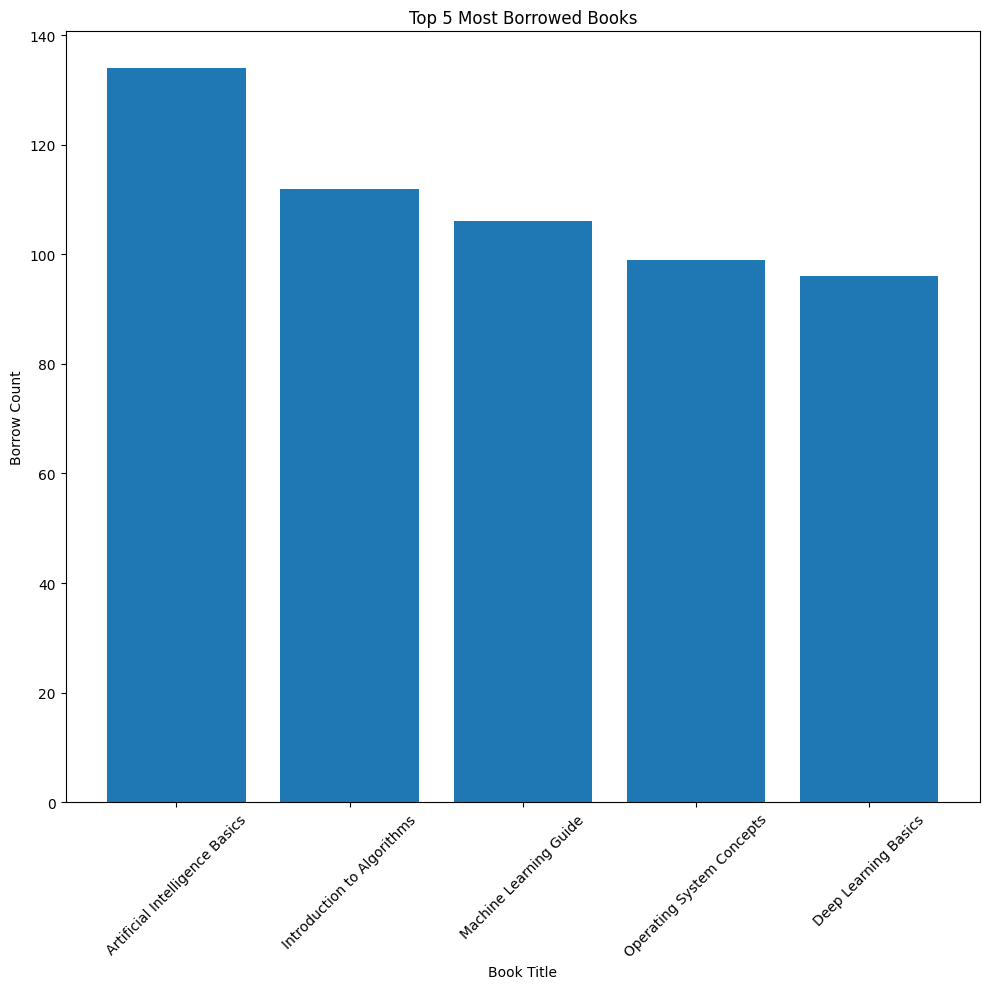
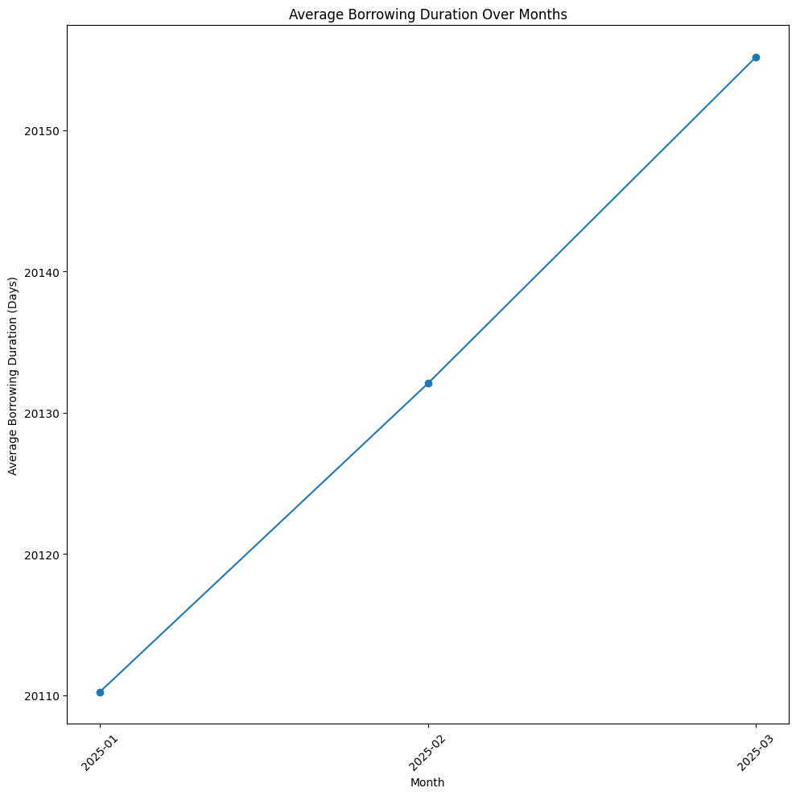
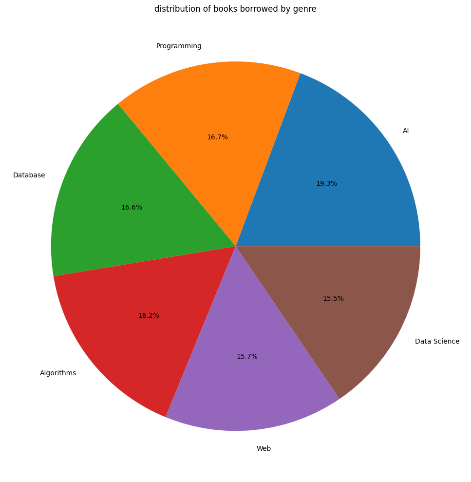
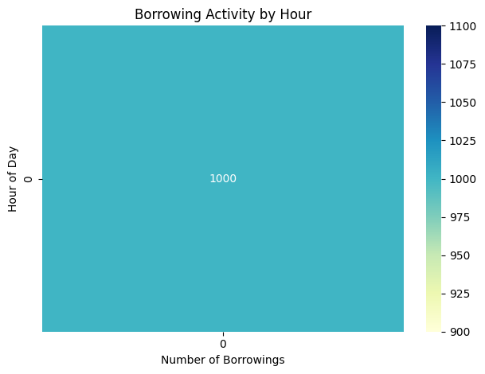

# 📚 E-Library Data Insights Dashboard

✨ A **Python-based Data Analytics Dashboard** built using  
**Object-Oriented Programming (OOP)** and **NumPy Arrays**  
to analyze and visualize **E-Library transaction data**.

This project transforms raw library data into **meaningful insights**
using statistics and visual dashboards.

---

## 🧠 Core Concepts Used

### 🔹 Object-Oriented Programming (OOP)
- `LibraryDashboard` class for modular design
- Encapsulation of:
  - Data loading
  - Data cleaning
  - Statistical analysis
  - Filtering logic
- Improves **code reusability, readability, and scalability**

### 🔹 NumPy Arrays
- Borrowing duration data converted to NumPy arrays
- Used for:
  - Mean calculation
  - Maximum & minimum duration
  - Efficient numerical operations

---

## 🚀 Features

✅ Load & clean library transaction data  
✅ Statistical analysis of borrowing duration  
✅ Identify most borrowed books  
✅ Monthly borrowing trend analysis  
✅ Genre-wise distribution visualization  
✅ Hourly borrowing activity heatmap  

---

## 🛠️ Technologies Used

- 🐍 Python  
- 📊 Pandas  
- 🔢 NumPy  
- 📈 Matplotlib  
- 🎨 Seaborn  

---

## 📂 Dataset Details

📄 **File:** `library_transactions.csv`  
📊 **Records:** 1000+ transactions  

### Columns:
- Book_Title
- Genre
- Category
- Date
- Borrowing_Duration_Days

---

## 📊 Dashboard Visualizations

### 🔹 Top 5 Most Borrowed Books
📌 Identifies the most popular books in the library.



---

### 🔹 Monthly Borrowing Trends
📌 Shows how average borrowing duration changes over months.



---

### 🔹 Genre-wise Distribution
📌 Displays reader interest across different genres.



---

### 🔹 Borrowing Activity by Hour (Heatmap)
📌 Highlights peak library usage hours.



---

## 📈 Statistical Insights

📌 **Borrowing Duration**
- Average duration
- Maximum duration
- Minimum duration  

📌 **Grouped Analysis**
- Total borrowings per book
- Average borrowing duration by genre  

---

## ▶️ How to Run the Project

### Install dependencies
```bash
pip install pandas numpy matplotlib seaborn
